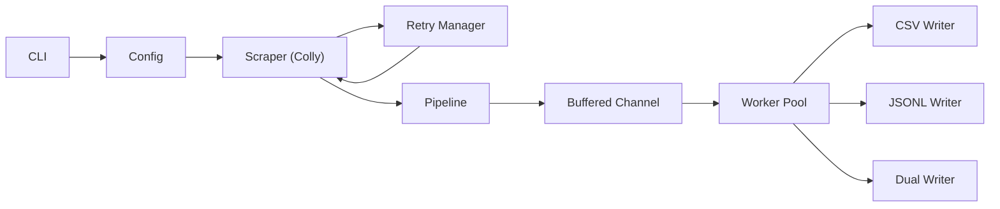

# Go Books Scraper: Production-Grade Streaming ETL
Production-grade streaming ETL processing 2.2M items/sec with bounded memory and low-allocation pipelines.


A high-throughput, bounded-memory web scraper engineered in Go. This project demonstrates how to architect a production-ready data pipeline that balances concurrency, backpressure, and observability to scrape [books.toscrape.com](https://books.toscrape.com) reliably at scale.

**Core Strategies:**
- **Streaming Pipeline:** Low-allocation data flow from ingestion to disk using buffered channels.
- **Resiliency:** Custom retry manager with exponential backoff and typed error handling.
- **Bounded Concurrency:** Worker pools with strict rate limiting to respect target infrastructure.
- **Dual Output:** Simultaneous CSV and JSONL (newline-delimited JSON) for maximum compatibility.
- **Observability:** Native Prometheus metrics integration and structured logging.

## Real-World Applications

- Price monitoring for retail/catalog sites.
- Competitive intelligence via scheduled crawl diffs.
- Data aggregation pipelines for analytics/ETL.

## Benchmark Proof

**Two metrics, two purposes:**

| Metric                    | Value          | What It Measures                          |
| ------------------------- | -------------- | ----------------------------------------- |
| **Pipeline Throughput**   | 2.2M items/sec | Isolated in-memory benchmark (no network) |
| **Production Throughput** | 108 items/sec  | End-to-end with real HTTP requests        |

The 20,000x difference is intentional. The pipeline benchmark isolates the channel/worker architecture to prove it will **never be the bottleneck**—even at massive scale. Production throughput is network-bound by design: polite delays, rate limiting, and HTTP latency dominate. This headroom means the system can scale to faster targets (APIs, local caches) without architectural changes.

**Pipeline Microbenchmark** *(in-memory, no I/O)*

| Workers | Items/sec | Memory (B/op) | Allocs/op |
| ------- | --------- | ------------- | --------- |
| 4       | 2,161,210 | 326           | 4         |
| 8       | 2,184,634 | 327           | 4         |
| 16      | 2,230,688 | 326           | 4         |

**Production Run** *(network-bound, respecting rate limits)*
```text
2025/11/04 05:04:56 Scraping https://books.toscrape.com (pages=50, workers=16)
--------------------------------------------------
Scrape complete
  Total items:   1000
  Duration:      9.23s
  Items/sec:     108.34
  Errors:        0
--------------------------------------------------
```

**Architecture Overview**


## Problem Statement

Naïve scrapers often fail in production because they load entire datasets into memory or spawn unbounded goroutines, leading to Out-Of-Memory (OOM) crashes and IP bans. The challenge was to architect a system that maintains a **constant memory footprint** regardless of crawl size (1k vs 1M pages) while gracefully handling network volatility and respecting the target site's rate limits.

## Technical Decisions

### Architecture: Channel-Based Streaming Pipeline
Instead of a batch-process model, I implemented a streaming architecture using buffered channels and a worker pool. This decouples the scraping layer (Producer) from the I/O layer (Consumer). By introducing a bounded buffer (default: 512 slots), the system exerts **natural backpressure**: if disk I/O stalls, the pipeline blocks, which propagates "upstream" to the scraper, automatically slowing down network requests. This prevents memory spikes during network bursts. I chose strict LRU deduplication over Bloom filters to guarantee zero duplicates with O(1) lookups, providing deterministic consistency at the cost of a fixed, predictable memory cap.

### Engine: Colly vs. Headless Browsers
I selected `colly` over headless solutions like Puppeteer to prioritize throughput and resource efficiency. Since the target is static HTML, a full rendering engine incurs unnecessary 100x CPU/RAM overhead. `colly` enables fine-grained control over connection pooling (`http.Transport`), keep-alives, and standardized `context.Context` cancellation. To handle the inherent unreliability of networks, I implemented a custom Retry Manager with **exponential backoff** and domain-specific typed errors (`ErrRateLimited`, `ErrNetwork`), ensuring transient failures are handled gracefully without crashing the pipeline.

## Implementation Details

- **Concurrency:** Semaphores limit active requests; `sync.WaitGroup` ensures graceful shutdown of writer workers.
- **I/O Optimization:** Writers use intermediate buffers (`bufio`) to batch 64 records before flushing to disk, reducing syscalls.
- **Testing:** Table-driven unit tests for parsers; integration tests use a local HTTP server to mock network responses.

## Usage

```bash
make help          # Show all available targets and options
```

**Standard Run**
```bash
make scrape        # Default: 50 pages, 16 workers, dual output
```

**Custom Configuration**
```bash
make scrape PAGES=10 PARALLEL=4          # Quick test run
make scrape FORMAT=json PAGES=100        # JSONL-only, 100 pages
```

**With Prometheus Metrics**
```bash
make scrape ARGS='-metrics-addr :9090'
```
Metrics available at `localhost:9090/metrics`.

**Run Tests & Benchmarks**
```bash
make test          # Run full test suite
make bench         # Run pipeline throughput benchmarks
```
